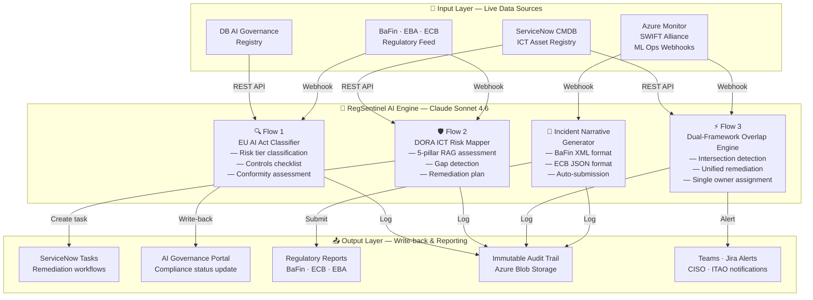
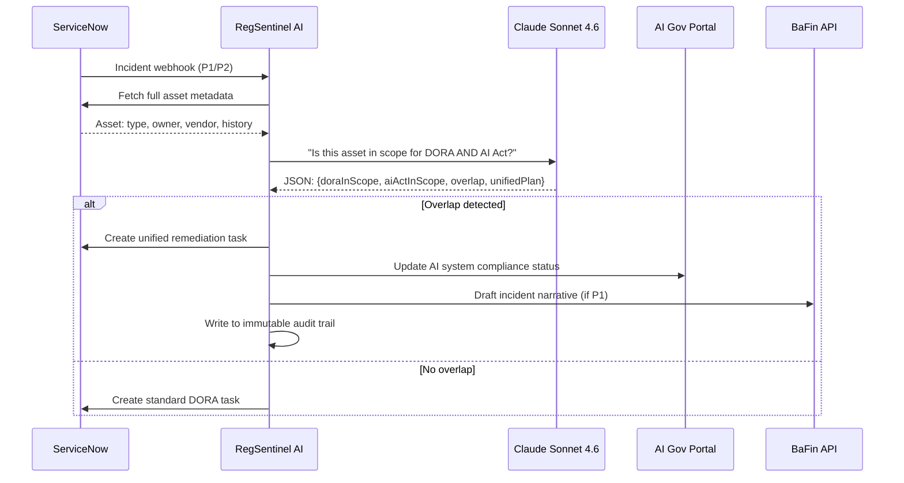

# RegSentinel AI — Integration Architecture

## Full System Diagram



## Data Flow for Overlap Detection (Key Differentiator)



## Sovereign Architecture

```
┌─────────────────────────────────────────────┐
│           AZURE EU REGION                   │
│     Frankfurt (Primary) · Amsterdam (DR)    │
│                                             │
│  ┌──────────────┐  ┌───────────────────┐   │
│  │ RegSentinel  │  │  Claude Sonnet    │   │
│  │   Frontend   │  │  4.6 API (EU)     │   │
│  └──────┬───────┘  └────────┬──────────┘   │
│         │                   │              │
│  ┌──────▼───────────────────▼──────────┐   │
│  │        ServiceNow · CMDB · Logs     │   │
│  └─────────────────────────────────────┘   │
│                                             │
│  ✅ No data egress outside EU               │
│  ✅ AI Act Article 10 compliant             │
│  ✅ DORA Art. 30 third-party controls       │
└─────────────────────────────────────────────┘
```

## Production Integration Checklist

- [ ] ServiceNow CMDB REST API credentials configured
- [ ] AI Governance Registry endpoint registered
- [ ] BaFin regulatory feed subscription active  
- [ ] Azure Monitor webhook → RegSentinel endpoint
- [ ] SWIFT Alliance alert feed connected
- [ ] Immutable audit log (Azure Blob, WORM policy) provisioned
- [ ] BaFin sandbox reporting credentials obtained
- [ ] CISO / ITAO Teams webhook configured
